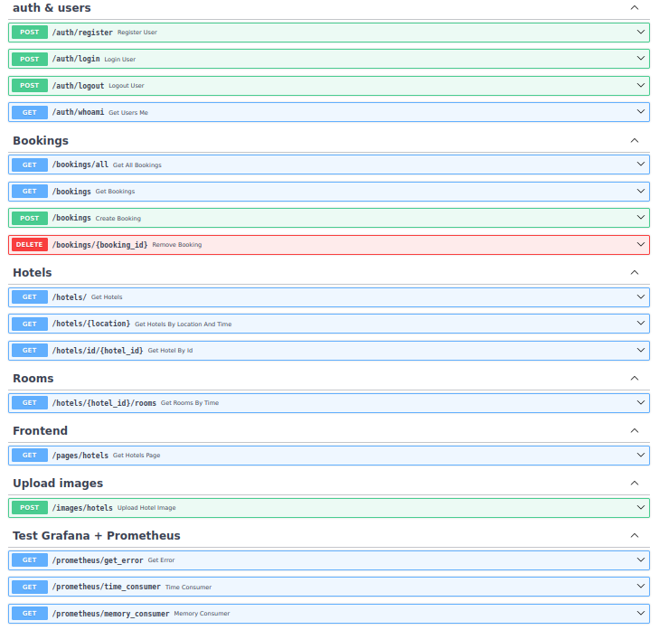
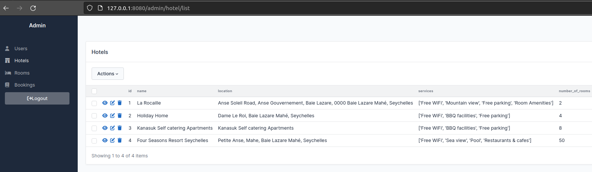
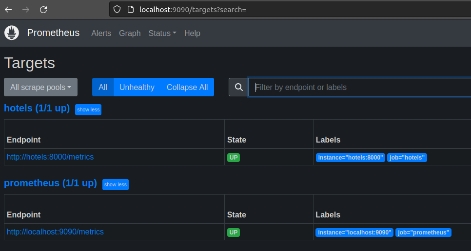
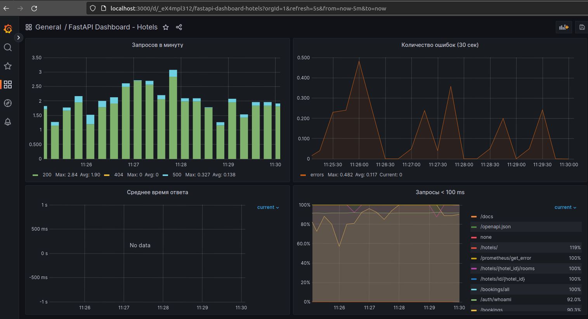
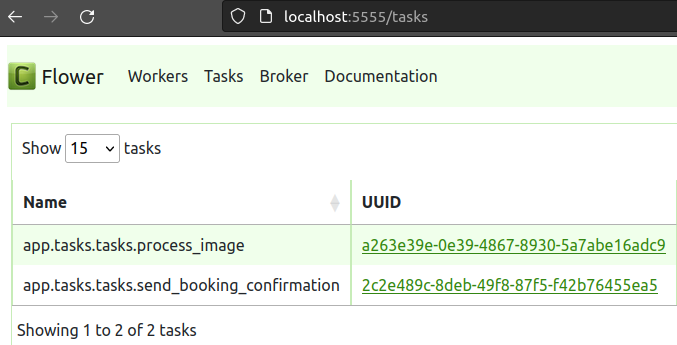

# FastAPI-Hotels

This project is 1/2 test assignment and 1/2 pet project for skills development and demonstration.

The FastAPI Hotel Booking project is a web application designed to facilitate hotel booking reservations. It allows users to browse available hotels, view details of each hotel, and make reservations for their desired dates. The project primarily serves as a RESTful API for hotel booking operations.

## Technologies used:
* __FastAPI:__ For building the RESTful API, providing high performance and asynchronous capabilities.
* __SQLAlchemy 2:__ As the ORM (Object-Relational Mapping) tool to interact with the PostgreSQL database, making it easier to manage and query hotel and user data.
* __Alembic:__ Used for database migrations, allowing smooth updates to the database schema as the project evolves.
* __Pydantic:__ For data validation, serialization, and modeling, ensuring clean and efficient data handling.
* __PostgreSQL:__ The chosen relational database system for storing hotel information, user data, and reservations.
* __Redis for Caching:__ Utilized for caching frequently accessed data, improving application speed and responsiveness.
* __Redis as a Message Broker:__ Acts as a message broker for communication between components using publish-subscribe patterns.
* __Celery:__ A distributed task queue system, integrated for handling background tasks such as email notifications.
* __Flower:__ Provides a real-time monitoring and management dashboard for Celery, allowing administrators to monitor task progress.
* __Pytest:__ Employed for testing the application, ensuring its reliability and correctness.
* __Sentry:__ For error tracking and monitoring, helping to identify and resolve issues in real-time.
* __Prometheus:__ Used for collecting and storing metrics from the application, enabling performance monitoring and analysis.
* __Grafana:__ Integrated with Prometheus to create visual dashboards for monitoring application metrics and performance in real-time.
* __SQLAdmin:__ Used for database administration, providing a graphical user interface and tools for managing PostgreSQL database.

## How to run:

* Clone project.

* Create .env file based on .env.example.
 
* Run containers:
 ```bash
 docker compose up --build
 ```
 
* Optional: load sample data from test_data_db.sql
 
* Check endpoints with OpenAPI docs:
http://localhost:8080/docs

 
 
* Admin panel:
 http://localhost:8080/admin

 
 
* Prometheus:
http://localhost:9090

 
 
* Grafana:
http://localhost:3000

 
 
* Flower:
http://localhost:5555/

 


./app.sh

alembic revision --autogenerate -m 'initial migration'

alembic upgrade head

docker run -d --name redis_db -p 6379:6379 redis  

celery -A app.tasks.celery:celery worker --loglevel=INFO

celery -A app.tasks.celery:celery flower  # http://localhost:5555/

http://127.0.0.1:8000/pages/hotels?location=Sey&date_from=2023-09-21&date_to=2023-09-28

